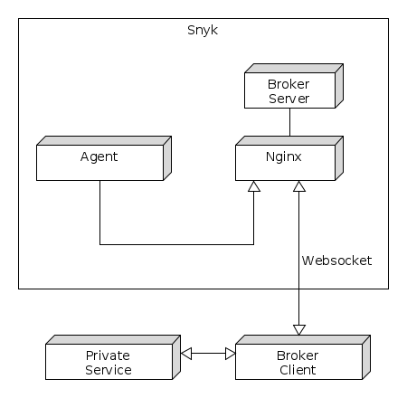
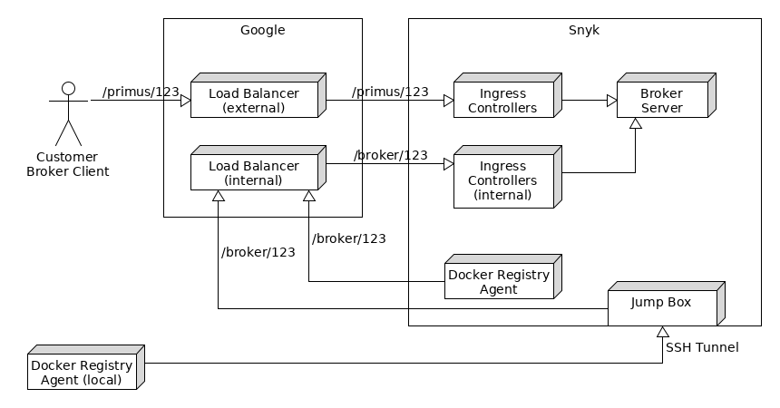

What are we trying to do?

Some of our customers want to scan container images which they have stored in private (i.e. not accessible from the internet) container registries (CRs). We want to enable them by having them run a software (called "broker client") in their environment which has access to the private registry.

More on the broker: https://github.com/snyk/broker
It is basically a P2P application which we call client and server so we can refer to specific instances.

The broker client connects to a broker server which runs in our (Snyk's) environment and registers itself. Our services can now access the private CR by talking to the broker server.



The broker server and client are connected via a websocket. The connection is always initiated by the client and the requests come always from the server side.

We noticed that transferring larger files causes an issue, with the Websocket connection dropping intermittently. It also seems that although the data is send in a stream from the client, that the server only receives part of the data. It stops, continues for a bit and then stops completely.

The full (more detailed) setup looks like this:



The idea is that a customer runs a Broker client in their environment which has access to the private registry. The broker client connects to a Broker server which runs in our environment and registers itself with a Broker ID (here 123). Our services can now access the private registry by talking to the broker server. It is only possible to access the private registry through the broker server from within the dev/prod cluster via an internal-only load balancer.

The ingress controller which handles the websocket connection has the following configuration:
```
nginx.ingress.kubernetes.io/proxy-http-version: "1.1"
nginx.ingress.kubernetes.io/proxy-body-size: 1g
nginx.ingress.kubernetes.io/upstream-hash-by: "$broker_id"
nginx.ingress.kubernetes.io/configuration-snippet: |2
  set $broker_id "unknown";
  if ( $uri ~ ^/primus/([^/]+)/ ) {
    set $broker_id $1;
  }

  server_tokens off; # do not display nginx version (401 etc.)

  proxy_set_header Upgrade $http_upgrade; # Websocket support
  proxy_set_header Connection "Upgrade";
nginx.ingress.kubernetes.io/proxy-redirect-from: http://
nginx.ingress.kubernetes.io/proxy-redirect-to: https://
```
We use the `broker_id` to route the request to the correct broker server.

A demonstration of the issue can be found in the file `demo.mp4`.
